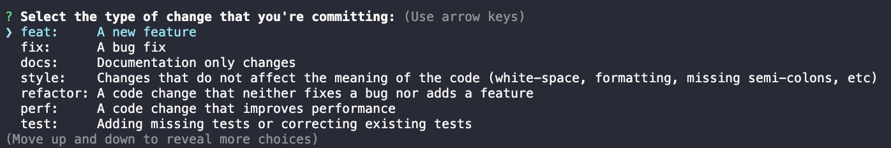

# FrilansareSverige.se

This is the Git repo for the page https://frilansaresverige.se/

[](http://commitizen.github.io/cz-cli/)

## Getting Started with development

This is a [Next.js](https://nextjs.org/) project.

To the development server:

```bash
npm run dev
```

Open [http://localhost:3000](http://localhost:3000) with your browser to see the result.

You can start editing the page by modifying `pages/index.tsx`. The page auto-updates as you edit the file.

## Contributions

Bring your ideas to #frilansaresverigese in our Slack.

Fork & pull request - make sure to attach a screenshot of the effect of your change so it is easy to review 👍

## Husky and Conventional commit strategy 🐶 
This repository uses husky git hooks adapter together with commitizen conventional commits. This ensures a unified code style and fail-fast commit strategy with clear messages. 

**For contributors not familiar with conventional commits**

Just go ahead and commit as usual:
```bash
git commit
git commit -m "message"
``` 

This will first run the pre-commit hooks provided through _husky_ which will run lint and format checks of your code using `next lint` and `prettier`.

You will then be prompted to fill in some required fields regarding your commit and commitizen will format the message for you. Easy peasy!

